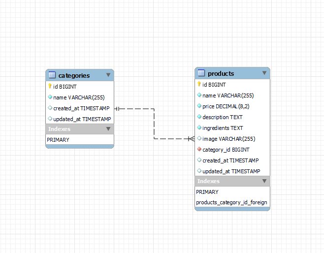

## Ideen

- **Kioskapp mit anderen Technologien entwickeln und weiterführen**
- ~~Blackjack Online Spiel~~
- ~~Simple Habitapp~~

## Technologien

- Vue
- JS
- PHP
- Laravel
- HTML/CSS
- ~~MongoDB~~
- MySQL
- ~~MSSQL~~

## Konzept und Planung

Das Projekt wird eine einfache Kiosk App sein, entwickelt mit Vue.js für das Frontend und Laravel für das Backend. Unser Ziel ist es, eine intuitive Benutzeroberfläche mit einer robusten Backend-Integration zu schaffen. Die ersten Meilensteine umfassen das Einrichten der Projektstruktur, das Entwickeln der Grundfunktionalitäten und die Implementierung der Datenbankanbindung. Wir werden kleine, realistische Ziele setzen, um den Fortschritt kontinuierlich zu verfolgen und anzupassen.

## ER-Diagramm Datenbank



## Lokales Setup

### Commands für Docker

```bash
# Alle Docker Container im Hintergrund starten
docker compose up -d

# Laravel Container neu seeden und migrieren
docker compose exec laravel php artisan migrate:fresh --seed

# Alle Docker Container herunterfahren
docker compose down
```
 

### Run Fontend in Dev Mode

```bash
# Startet die Applikation im Localhost
npm run dev
```

### Frontend Anleitung

- Gewünschte Artikel mit Filterfunktion suchen 
- Artikel per klick der Rechnung hinzufügen
- Per Knopfdruck Rechnung anzeigen
- Artikel löschen, hinzufügen oder Menge ändern und Preise betrachten
- (Rechnung bezahlen)
